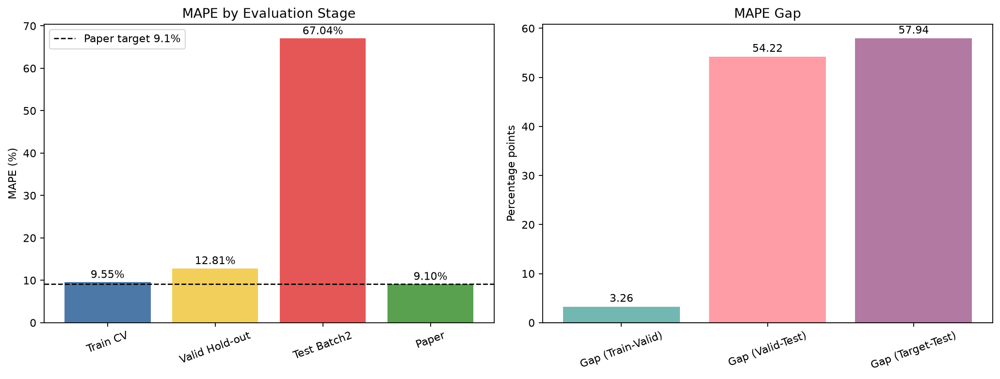

# ESS 배터리 조기 수명 예측

배터리의 초기 100사이클에서 얻은 충전 조건, 용량, 내부 저항, 온도, 충전 시간과 ΔQ(V) 피처로 최종 수명(`cycle_life`)을 예측하는 회귀 프로젝트다. Batch1에서 탐색적 분석과 모델 선택을 진행하고, 확정한 모델을 Batch1 전체로 다시 학습한 뒤 Batch2에서 배치 간 일반화 성능을 확인했다.

## 프로젝트 개요

- 데이터셋 : MIT-Stanford Battery Dataset (Severson et al., Nature Energy 2019)
- 학습·검증 데이터: Batch1 46개 셀
- 최종 테스트 데이터: Batch2 47개 셀
  - `cycle_life`가 있는 39개 셀만 성능 계산에 사용
  - 정답이 없는 8개 셀은 예측값만 저장
- 태스크: 초기 100사이클 정보로 `cycle_life`를 예측하는 회귀
- 모델링 단위: 배터리 셀당 1행
- 주요 평가 지표: MAPE

사이클별 행을 무작위로 나누면 같은 셀의 기록이 학습과 검증에 동시에 들어갈 수 있다. 이를 피하기 위해 피처를 셀 단위로 집계한 뒤 Batch1을 학습 34개와 hold-out 검증 12개로 분리했다.

## 파일 구조

```text
├── data/
│   ├── Batch1
│   ├── Batch2
│   ├── download_data.py
│   └── README.md
├── notebooks/
│   ├──01_EDA_FeatureEngineering.ipynb  # 데이터 구조 확인, EDA, 피처 설계
│   └──02_modeling.ipynb                # 모델 비교, 검증, Batch2 테스트
├── output/
│   ├── model/
│   │   ├── batch1_features.csv
│   │   └── batch2_features.csv
│   └── batch1_train_validation/
│       ├── candidate_model_comparison.csv
│       ├── validation_predictions.csv
│       ├── batch2_test_predictions.csv
│       ├── performance_report.csv
│       ├── feature_importance.csv
│       ├── selected_model_train_only.joblib
│       ├── final_model_batch1_all.joblib
│       ├── performance_mape_chart.png
│       └── run_metadata.json
└── README.md
```

## 실행 방법

1. 원본 데이터가 없다면 프로젝트 루트에서 `python data/download_data.py`를 실행한다.
2. `data/` 폴더에 Batch1과 Batch2가 생성됐는지 확인한다.
3. `notebooks/01_EDA_FeatureEngineering.ipynb`를 실행해 EDA와 초기 100사이클 피처 생성 과정을 확인한다.
4. `notebooks/02_modeling.ipynb`를 위에서부터 실행한다.

노트북은 현재 Jupyter 커널에서 필요한 패키지를 확인하고, 없는 패키지만 자동으로 설치한다. 모델링에 사용하는 주요 패키지는 `numpy`, `pandas`, `scikit-learn`, `matplotlib`, `joblib`이다.

## EDA 결과

### Cycle Life 분포

Batch1의 46개 셀은 534~1,227사이클에 분포했다. 평균은 844.7사이클, 중앙값은 858.5사이클이며 절반의 셀이 703.2~914.2사이에 있었다. `cycle_life > 1,000`인 셀은 10개였지만 `<500`인 셀은 없었다. 절대 기준만으로 장·단수명 그룹을 비교하기 어려워 Batch1 내부 비교에는 하위 25%와 상위 25%를 사용했다.

### 열화 곡선과 Knee point

대부분의 셀은 초기 약 1.06~1.10 Ah에서 시작해 초기 용량만으로 수명 차이를 구분하기 어려웠다. 열화 곡선 분석에서는 `QD ≤ 0`, 유한하지 않은 값, 셀별 초기 공칭 용량의 120%를 넘는 값만 제외했다. 공칭 용량의 80% 이하 값은 말기 열화 또는 EOL 신호일 수 있어 유지했다.

Knee point는 전체 수명 곡선을 사용해 계산되므로 열화 과정을 설명하는 진단값으로만 다뤘다. 초기 수명 예측 피처에는 포함하지 않았다.

### ΔQ(V)

사이클 10과 100의 방전 곡선을 공통 전압 구간에 보간한 뒤 `ΔQ(V)=Q₁₀₀(V)-Q₁₀(V)`를 계산했다. 평균, 최솟값, 분산, 절대 면적을 셀 단위 피처로 사용했다. 일부 셀은 원본의 `cycles/V` 또는 `cycles/Qd`가 비어 있을 수 있어 계산 가능 여부를 함께 확인했다.

### 충전 조건과 초기 신호

충전 정책 문자열은 `first_C`, `switch_SOC`, `second_C`로 분리했다. Batch1에서 `5.4C(80%)-5.4C` 정책의 두 셀은 각각 534, 559사이클로 가장 짧았고, `4C(80%)-4C`의 두 셀은 1,226, 1,227사이클로 길었다. 정책별 표본이 적고 온도·충전 시간이 함께 달라질 수 있으므로 충전 정책의 인과효과로 단정하지 않았다.

초기 100사이클 평균 피처 중 `mean_chargetime`과 수명의 Pearson 상관은 0.577이었다. `mean_Tavg`는 -0.482, `mean_Tmax`는 -0.404였다. 평균 온도와 최고 온도의 상관은 0.96으로 높아, 모델링에서는 중복 정보를 줄이기 위해 평균 온도를 대표 피처로 사용했다.

## Modeling

### 피처 엔지니어링

총 24개 피처를 사용했다.

- 충전 조건: 1단계 C-rate, 전환 SOC, 2단계 C-rate
- 방전 용량: QD 평균, 표준편차, 기울기, 10→100사이클 변화량
- 내부 저항: IR 평균, 표준편차, 기울기, 10→100사이클 변화량
- 온도: 평균, 표준편차, 기울기, 변화량, 평균 온도 범위
- 충전 시간: 평균, 표준편차, 기울기, 변화량
- ΔQ(V): 평균, 최솟값, 분산, 절대 면적

전체 수명 곡선을 사용해야 알 수 있는 Knee point와 식별자인 `cell_id`는 예측 피처에서 제외했다. 결측치 대체와 스케일링은 `Pipeline` 안에서 처리해 학습 fold의 정보만 사용하도록 구성했다.

### 데이터 분리와 모델 선택

Batch1을 수명 사분위 비율이 유지되도록 학습 34개와 hold-out 검증 12개로 나눴다. 후보 모델과 하이퍼파라미터는 학습 데이터 내부 4-fold 교차검증의 MAE로 비교했다.

| 모델 | Train CV MAE | 표준편차 |
|---|---:|---:|
| GradientBoosting | **75.71** | 6.67 |
| ExtraTrees | 81.47 | 17.18 |
| RandomForest | 86.40 | 15.90 |
| ElasticNet | 143.58 | 17.73 |
| Dummy | 148.32 | 20.02 |
| Ridge | 220.61 | 148.43 |

최종 후보로 GradientBoosting을 선택했다. 사용한 설정은 다음과 같다.

```text
learning_rate = 0.05
max_depth = 2
min_samples_leaf = 4
n_estimators = 200
```

선택된 모델을 학습 분할에 적합한 뒤 Batch1 hold-out으로 검증했다. 모델과 설정을 확정한 다음에는 Batch1 전체 46개로 다시 학습해 Batch2를 테스트했다. Batch2 성능을 보고 후보나 설정을 다시 고르지는 않았다.

## 성능 결과

| 구분 | MAPE (%) | 비고 |
|---|---:|---|
| Train (Batch1 CV) | 9.55 | Batch1 학습 셀 내부 4-fold CV 평균 |
| Valid (Batch1 Hold-out) | 12.81 | 모델 선택에 사용하지 않은 Batch1 12개 셀 |
| Test (Batch2) | 67.04 | 정답이 있는 Batch2 39개 셀 |
| Gap (Train-Valid) | 3.26 | 양수이면 과적합 가능성 점검 |
| Gap (Valid-Test) | 54.22 | Batch2에서 일반화 성능 저하 |
| Gap (Target-Test) | 57.94 | 원논문 MAPE 9.1%와의 차이 |

Batch1 hold-out 성능은 MAE 99.4사이클, RMSE 120.2사이클, R² 0.536이었다. Batch2에서는 MAE 323.3사이클, RMSE 350.3사이클, R² -1.550으로 악화됐다.



원논문의 MAPE 9.1%와 비교하면 이번 Batch2 MAPE는 57.94%p 높고 수치상 약 7.4배다. 다만 논문과 이번 프로젝트는 데이터 분할과 피처 구성이 완전히 같지 않아 동일 조건의 재현 성능으로 단정할 수 없다.

## 오류 분석

Batch1의 수명 범위는 534~1,227사이클이지만, 정답이 있는 Batch2 셀의 범위는 392~1,186사이클이었다. Batch2 평가 셀 39개 중 30개가 Batch1의 최단 수명인 534사이클보다 짧았다. Batch1과 Batch2에서 이름이 동일한 충전 정책도 Batch2의 20종 중 2종뿐이었다.

Batch2 예측 오차는 실제보다 높게 예측하는 방향으로 치우쳤다. `predicted_cycle_life - cycle_life`의 중앙값은 334.8사이클이었다. 가장 큰 오차는 Batch2 Cell 41에서 발생했으며 실제 442사이클을 1,065.8사이클로 예측해 623.8사이클 차이가 났다.

이 결과는 Batch1에서 학습한 수명 범위와 충전 조건이 Batch2를 충분히 포함하지 못했음을 보여준다. 현재 모델은 Batch1 내부 패턴은 일부 설명하지만, 새로운 배치의 짧은 수명 셀을 과대예측하는 한계가 있다.

개선 방향은 다음과 같다.

- Batch1과 Batch2의 피처 분포와 측정 구조 차이를 먼저 확인한다.
- 배치에 따라 값이 크게 변하는 피처와 이상값 처리 기준을 다시 점검한다.
- 새로운 충전 정책을 하나의 그룹으로 분리하는 GroupKFold 스트레스 테스트를 추가한다.
- 여러 제조 배치와 운전 조건을 학습 데이터에 포함한 뒤 외부 테스트를 다시 수행한다.

## ESS 도메인 해석

초기 사이클만으로 수명을 안정적으로 예측할 수 있다면 셀 선별, 유지보수 우선순위 설정, 교체 시점 검토에 활용할 수 있다. 이번 모델에서는 ΔQ(V), 초기 충전 조건, 충전 시간, 내부 저항과 온도 변화가 주요 분기 피처로 사용됐다.

현재 Batch2 성능으로는 실제 BESS 운영 의사결정에 바로 적용하기 어렵다. 배치가 바뀌자 MAPE가 67.04%까지 증가했고 예측이 실제 수명을 높게 보는 경향도 확인됐다. 실 배포 전에는 다른 제조 배치와 운전 환경을 포함한 외부 검증, 예측 불확실성 제시, 입력 분포 이탈 감지와 주기적인 재학습 기준이 필요하다.

## 참고문헌

- Severson, K. A., Attia, P. M., Jin, N. et al. (2019). Data-driven prediction of battery cycle life before capacity degradation. *Nature Energy*, 4, 383–391.
